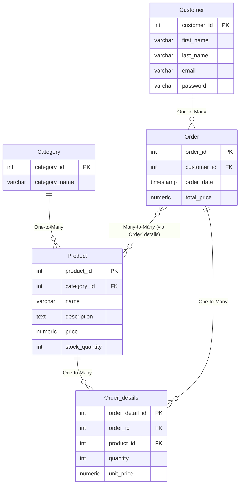

# Ecommerce Database Design


# 🧾 Database Schema Script
----------

## 📁 Category
```sql
CREATE TABLE Category (
    category_id SERIAL PRIMARY KEY,
    category_name VARCHAR(255) NOT NULL
);
```
----------

## 📦 Product
```sql
CREATE TABLE Product (
    product_id SERIAL PRIMARY KEY,
    category_id INT NOT NULL REFERENCES Category(category_id)
        ON DELETE CASCADE ON UPDATE CASCADE,
    name VARCHAR(255) NOT NULL,
    description TEXT,
    price NUMERIC(9,2),
    stock_quantity INTEGER DEFAULT 1
);
```
----------

## 👤 Customer
```sql
CREATE TABLE Customer (
    customer_id SERIAL PRIMARY KEY,
    first_name VARCHAR(80),
    last_name VARCHAR(80),
    email VARCHAR(255) NOT NULL,
    password VARCHAR(255) NOT NULL
);
```
----------

## 🛒 Order
```sql
CREATE TABLE "Order" (
    order_id SERIAL PRIMARY KEY,
    customer_id INT NOT NULL REFERENCES Customer(customer_id)
        ON DELETE RESTRICT ON UPDATE CASCADE,
    order_date TIMESTAMP DEFAULT NOW(),
    total_amount NUMERIC(9,2) NOT NULL
);
```
----------

## 📑 Order Details
```sql
CREATE TABLE Order_details (
    order_detail_id SERIAL PRIMARY KEY,
    order_id INT NOT NULL REFERENCES "Order"(order_id)
        ON DELETE CASCADE ON UPDATE CASCADE,
    product_id INT NOT NULL REFERENCES Product(product_id)
        ON DELETE RESTRICT ON UPDATE CASCADE,
    quantity INT DEFAULT 1,
    unit_price NUMERIC(9,2)
);
```
----------

## 🔗 Relationships

- **Category → Product:** One-to-Many  
  *(Participation: Partial – Total)*

- **Customer → Order:** One-to-Many  
  *(Participation: Partial – Total)*

- **Order → Order Detail:** One-to-Many  
  *(Participation: Total – Total)*

- **Product → Order Detail:** One-to-Many  
  *(Participation: Partial – Total)*

- **Order ↔ Product (Conceptual):** Many-to-Many  
  *(Implemented via `Order_details`)*

----------

##  📁ERD



# 📊 SQL Reporting Queries

---

## Query 1 : Generate a daily report of the total revenue for a specific date
```sql
SELECT SUM(total_amount) AS daily_revenue
FROM "Order"
WHERE DATE(order_date) = DATE 'THE_NEEDED_DATE';
```

## Query 2 : Generate a monthly report of the top-selling products in a given month.
```sql
SELECT 
    Product.name,
    SUM(Order_details.quantity) AS total_number_sold
FROM Order_details
JOIN 'Order' 
    ON Order_details.order_id = 'Order'.order_id
JOIN product 
    ON Order_details.product_id = Product.product_id
WHERE DATE_TRUNC('month', 'Order'.order_date) = DATE_TRUNC('month', DATE 'THE_NEEDED_MONTH')
GROUP BY Product.product_id, Product.name
ORDER BY total_number_sold DESC
LIMIT 5;
```

## Query 3 : Write a SQL query to retrieve a list of customers who have placed orders totaling more than $500 in the past month.
```sql
SELECT 
    c.first_name || ' ' || c.last_name AS customer_name,
    SUM(o.total_amount) AS total_spent
FROM Customer c
JOIN "Order" o ON c.customer_id = o.customer_id
WHERE o.order_date >= date_trunc('month', CURRENT_DATE - INTERVAL '1 month')
  AND o.order_date <  date_trunc('month', CURRENT_DATE)
GROUP BY c.customer_id, customer_name
HAVING SUM(o.total_amount) > 500
ORDER BY total_spent DESC;
```

# 📊 Denormalization
A denormalization mechanism can be applied by creating a **summary table** in the database that stores precomputed aggregates for each customer, such as total orders, total products bought, and total spending, which is automatically updated via a **database trigger**  to  enable faster reporting without repeatedly joining the `Customer` and `Order` and `Order Details` tables.

```sql
CREATE TABLE Customer_Order_Summary (
    customer_id INT PRIMARY KEY REFERENCES Customer(customer_id),
    total_orders INT DEFAULT 0,
    total_products INT DEFAULT 0,
    total_spent NUMERIC(12,2) DEFAULT 0,
    last_order_date TIMESTAMP
);
```
